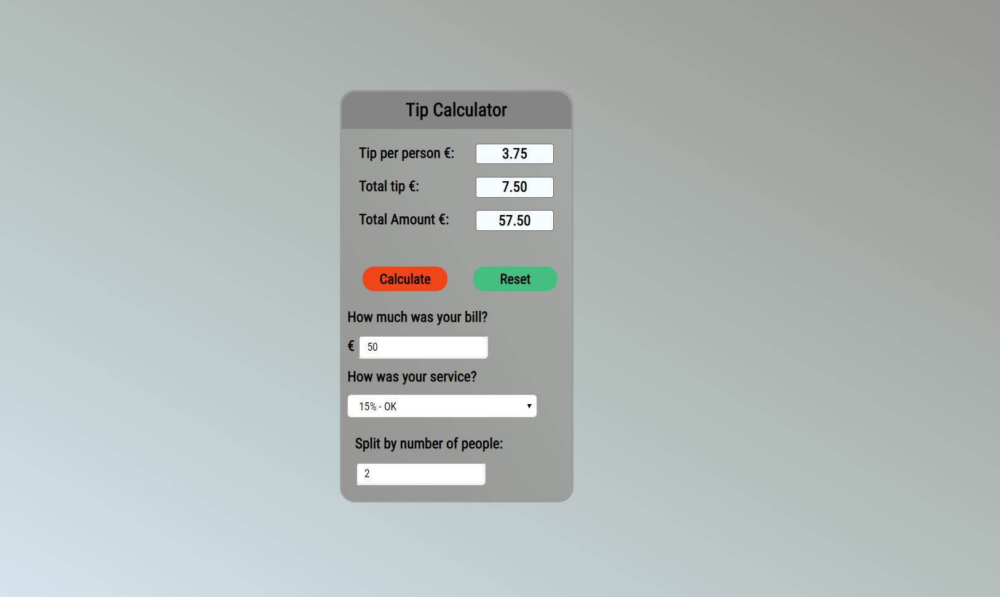

## TipCalculator.js

Tip Calculator is designed to help you find the amount that you need to pay on a night out.

The tips calculation (percentage) depends on how much you enjoyed the meal. 

You can find the tip for each person, the total tip and the total amount. You can also reset the entire calculation.  

